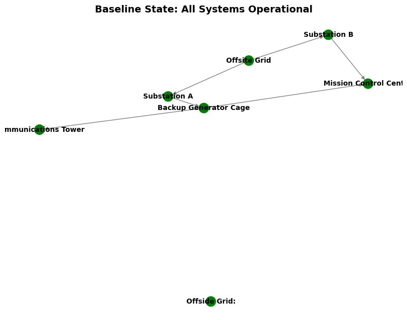
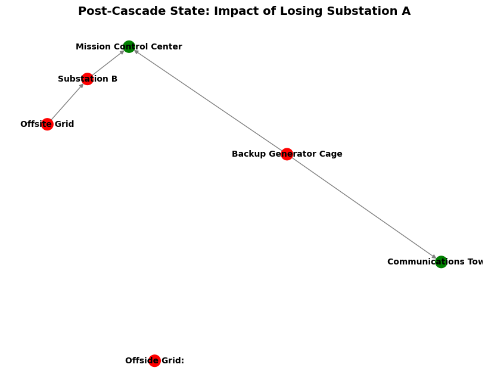

# Critical Infrastructure Dependency & Cascade Failure Modeling

A graph-theoretic simulation framework designed to model systemic risks, structural dependencies, and cascading operational losses within critical military installation power grids under targeted kinetic or cyber-physical threats.

## 📌 Project Overview
Modern defense operations centers rely on highly integrated, multi-layered power distribution systems. This project implements a directed dependency graph (`DiGraph`) to map physical assets—ranging from external supply grids and localized substations to backup resilience infrastructure—and evaluates how localized single points of failure can propagate systemic blackouts across mission-critical nodes.

## 🛠️ System Architecture & Topology
The network topology is built utilizing a directed graph where edges represent a strict structural dependency (`Source Node -> Dependent Node`). The installation is modeled using the following functional layers:
* **External Sources:** Offsite Grid
* **Distribution Nodes:** Substation A, Substation B
* **Resilience Layers:** Backup Generator Cage
* **Critical Assets:** Mission Control Center, Communications Tower

## 📊 Simulation Results & Vulnerability Analysis
The framework executes a targeted strike simulation by programmatically removing a critical distribution node and evaluation-tracking downstream connectivity status via path-checking algorithms.

### Impact Analysis: Targeted Strike on 'Substation A'
When a kinetic or cyber-physical exploit compromises **Substation A**, the simulation captures a critical cascading vulnerability:
1. **Substation A** is disabled.
2. The **Backup Generator Cage** loses its primary input power source, triggering a failure state.
3. Due to the loss of both primary and backup infrastructure, the downstream **Communications Tower** drops completely offline.

### Visualizations
Below are the topological graphs rendered using Matplotlib's headless `Agg` backend, contrasting the baseline operational network against the post-cascade compromise state.

| Baseline Operational State | Post-Cascade Compromise State |
|---|---|
|  |  |

## 🚀 Technical Stack & Libraries
* **Language:** Python 3.10+
* **Graph Analytics:** `networkx` — Used to initialize topologies, maintain directed edge relationships, and compute path traversal availability (`has_path`).
* **Data Visualization:** `matplotlib` — Configured with a headless backend (`matplotlib.use('Agg')`) to programmatically generate, color-code, and export high-fidelity asset status figures in headless Linux/WSL environments.

## ⚙️ How to Run the Simulation
Clone the repository and execute the master routine locally:

```bash
git clone [https://github.com/leboneboyer-debug/Graph-Based-Cascade-Failure-Modeling-for-Critical-Infrastructure.git]
cd YOUR_REPO_NAME
pip install -r requirements.txt
python main.py
